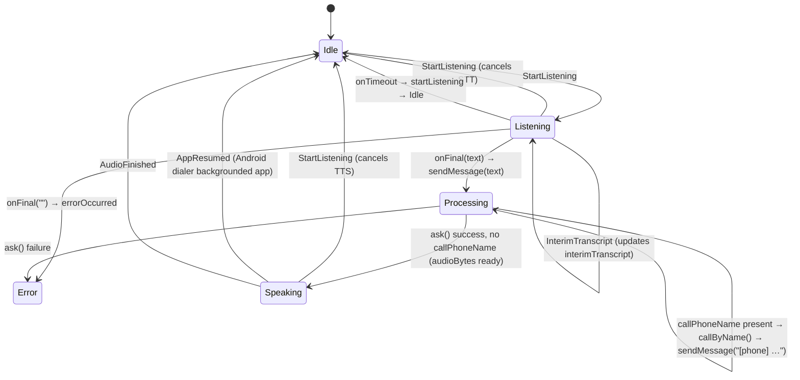

# AssistantBloc — State & Event Diagram



## States

| State | Fields | Description |
|-------|--------|-------------|
| `Idle` | — | Ready, mic button available |
| `Listening` | `interimTranscript` | STT active |
| `Processing` | `userMessage` | API call in progress |
| `Speaking` | `responseText` | TTS playback in progress |
| `Error` | `message` | Error displayed; next tap resets to Idle |

## Events

| Event | Fired by | Effect |
|-------|----------|--------|
| `StartListening` | User taps mic | Starts STT, or cancels current state |
| `InterimTranscript(text)` | STT partial result | Updates `interimTranscript` in `Listening` |
| `SendMessage(text)` | STT `onFinal` callback, or phone result relay | Triggers API call → `Processing` |
| `SpeakResponse(text, audioBytes)` | Repository response (no callPhoneName) | Starts TTS → `Speaking` |
| `AudioFinished` | TTS `onComplete` callback | Returns to `Idle` |
| `ErrorOccurred(message)` | STT empty result, network error | → `Error` |
| `AppResumed` | Android lifecycle | Resets `Speaking` → `Idle` |

## Phone call flow — [phone] feedback loop

The agent drives the entire phone call conversation.
The BLoC relays phone results back to the agent as `[phone]` system messages.

```
Listening
    │ STT onFinal("Appelle Marie")
    ▼
Processing(userMessage="Appelle Marie")
    │ ask() → callPhoneName="Marie"
    │ callByName("Marie") → PhoneCallAmbiguous([Marie Dupont, Marie Martin])
    │ sendMessage("[phone] plusieurs contacts correspondent à "Marie" : Marie Dupont et Marie Martin.")
    ▼
Processing(userMessage="[phone] …")
    │ ask() → agent formulates disambiguation question
    ▼
Speaking(responseText="Souhaitez-vous appeler Marie Dupont ou Marie Martin ?")
    │ AudioFinished → Idle

    ── user taps mic ──

Listening
    │ STT onFinal("Marie Dupont")
    ▼
Processing(userMessage="Marie Dupont")
    │ ask() → callPhoneName="Marie Dupont"
    │ callByName("Marie Dupont") → PhoneCallSuccess → dialer launched
    │ sendMessage("[phone] Marie Dupont appelé.")
    ▼
Processing(userMessage="[phone] Marie Dupont appelé.")
    │ ask() → agent confirms
    ▼
Speaking(responseText="J'appelle Marie Dupont. Bonne conversation !")
    │ AudioFinished → Idle
```

### Contact not found

```
Processing(userMessage="Appelle Bertrand")
    │ ask() → callPhoneName="Bertrand"
    │ callByName("Bertrand") → PhoneCallError("Je n'ai pas trouvé Bertrand dans vos contacts.")
    │ sendMessage("[phone] Je n'ai pas trouvé Bertrand dans vos contacts.")
    ▼
Processing(userMessage="[phone] …")
    │ ask() → agent explains
    ▼
Speaking(responseText="Je suis désolé, Bertrand n'est pas dans votre répertoire.")
    │ AudioFinished → Idle
```

### Disambiguation resolution — exactMatch flag

After a `PhoneCallAmbiguous`, the `[phone]` message includes the **full display
names** of the candidates (e.g. `Fred` and `Frederic`).

The user then says one of those names. The agent issues the next `call_phone` with
`exactMatch: true` in the payload:

```json
{ "type": "call_phone", "payload": { "name": "Fred", "exactMatch": true } }
```

When `exactMatch: true`, `callByName` switches from `contains` to `==` matching
(case-insensitive). This resolves the ambiguity:

```
callByName("Fred", exactMatch: true)
  → "fred" == "fred"      ✓ match
  → "fred" != "frederic"  ✗ no match
  → 1 result → PhoneCallSuccess
```

If multiple contacts share the exact name (rare), the first one is called without
entering `PhoneCallAmbiguous` again.

**⚠️ Loop risk without exactMatch** — if the agent re-issues `call_phone("Fred")`
without `exactMatch: true`, substring matching would return both contacts and the
flow re-enters `PhoneCallAmbiguous` indefinitely.

**Agent system prompt requirement:** after a `[phone] plusieurs contacts…`
message, the agent MUST set `exactMatch: true` when issuing the next `call_phone`.

### [phone] message formats

| Phone result | Message sent to agent |
|---|---|
| `PhoneCallSuccess` | `[phone] {contactName} appelé.` |
| `PhoneCallError` | `[phone] {errorMessage}` |
| `PhoneCallAmbiguous` | `[phone] plusieurs contacts correspondent à "{name}" : A, B et C.` |

The agent's system prompt is responsible for interpreting these messages,
formulating appropriate responses in French, and using exact display names
after a disambiguation.
